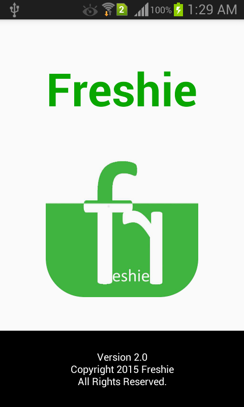
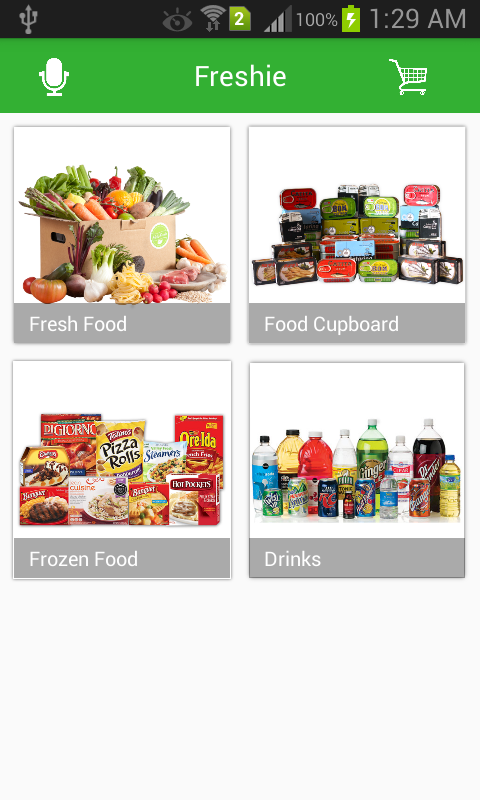
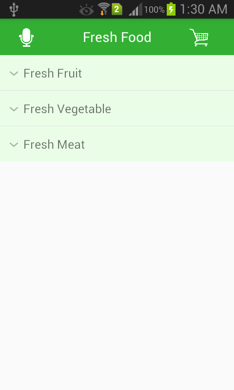
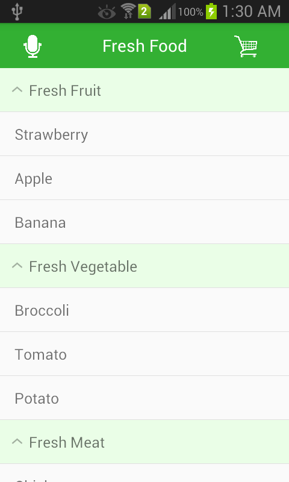
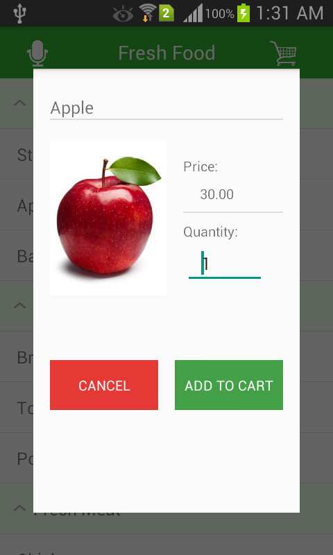
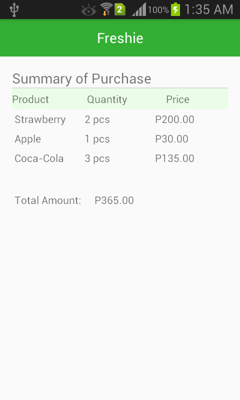
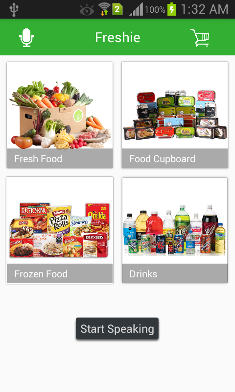

# Freshie-SeanWyndellQue&SeanHerbieChua

### Google Play Store:
https://play.google.com/store/apps/details?id=wynsean.freshie

### This project is a simulated online grocery application which includes features that help visually impaired people to navigate the app.

### Main Features:
  1. Text-to-Speech
  2. Voice Recognition

### Voice Recognition Keywords:
  1. "Main Menu"
  2. "Fresh Food"
  3. "Food Cupboard"
  4. "Frozen Food"
  5. "Drinks"
  6. "Strawberry"
  7. "Apple"
  8. "Banana"
  9. "Broccoli"
  10. "Tomato"
  11. "Potato"
  12. "Chicken"
  13. "Duck"
  14. "Turkey"
  15. "Corned Beef"
  16. "Sardines"
  17. "Canned Tuna"
  18. "Skyflakes"
  19. "Oreos"
  20. "Fita"
  21. "Cadburry"
  22. "Hershey's"
  23. "M&M's"
  24. "Frozen Steak"
  25. "Frozen Chicken"
  26. "Frozen Pork"
  27. "Bangus"
  28. "Salmon"
  29. "Tuna"
  30. "Magnolia Ice Cream"
  31. "Magnum Ice Cream"
  32. "Nestle Ice Cream"
  33. "Coca-Cola"
  34. "Pepsi"
  35. "Rootbeer"
  36. "C2 Iced Tea"
  37. "Orange Juice"
  38. "Grape Juice"
  39. "Absolute Bottled Water"
  40. "Summit Bottled Water"
  41. "Nature Spring Bottled Water"
  42. "Shopping Cart"

## Screenshots:

